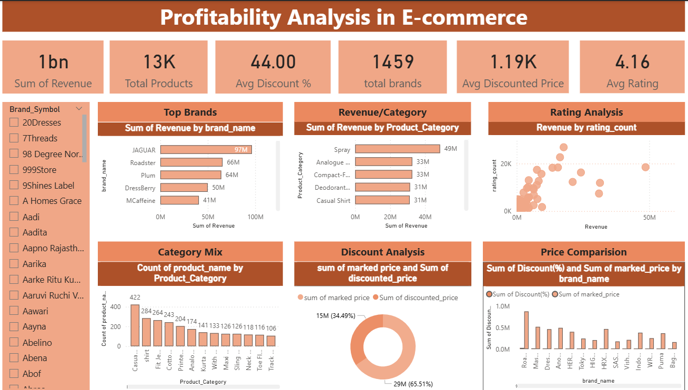

# Profitability-Analysis-in-E-commerce

---

## 📌 Project Overview

This project explores an e-commerce dataset from Myntra, using Excel for data preparation and Power BI to create an interactive dashboard, highlighting insights on sales trends, brand performance, Brand Categories, pricing, and discount behavior.

---

## 🎯 Objectives
- Analyze overall revenue and sales performance
- Identify top-performing brands and product categories
- Understand pricing and discount trends
- Study the impact of ratings on product performance

---

## 🧹 Data Cleaning & Preparation (Excel)

The raw dataset was cleaned and transformed in Excel before loading into Power BI:

- Removed duplicates and handled missing values
- Filtered irrelevant records
- Created the following **derived columns:**

| Derived Column | Description |
|----------------|-------------|
| `product_category` | Categorized products by type (tshirts, dresses, kurtas, etc.) |
| `revenue` | Calculated as discounted price × rating count |
| `discount (%)` | Computed percentage discount from marked and discounted price |
| `brand_symbol` | Short identifier for each brand |
| `product_id` | Unique ID assigned to each product |

---

## 📂 Dataset

| Column | Description |
|--------|-------------|
| `product_name` | Name of the product |
| `brand_name` | Brand of the product |
| `rating` | Customer rating |
| `rating_count` | Number of customer ratings |
| `marked_price` | Original listed price (₹) |
| `discounted_price` | Final selling price after discount (₹) |
| `sizes` | Available sizes |
| `product_link` | Myntra product URL |

- **Total Products:** 13,000
- **Total Brands:** 1,459
- **Price Range:** ₹49 – ₹44,950
- **Average Rating:** 4.16
- **Average Discount:** 44.00%

---

## 📊 Dashboard Overview

The Power BI dashboard includes the following sections:

### 🔢 KPI Cards
- Total Revenue — **1 Billion**
- Total Products — **11K**
- Total Brands — **1459K**
- Average Discount % — **44.00%**
- Average Discounted Price — **₹1.19K**
- Average Rating — **4.16**

### 📈 Visuals
- **Top Brands** — Bar chart showing top brands by total revenue (JAGUAR leads)
- **Revenue by Category** — Horizontal bar chart (SPRAY & Analogue categories)
- **Price Range** — Column chart showing product count by price bucket
- **Category Mix** — Donut chart showing product distribution by category
- **Price Comparison** — Combined chart of avg discounted price vs marked price by brand
- **Discount Analysis** — Pie chart showing avg discount % by product category

### 🔍 Filters
- Brand name slicer for interactive filtering across all visuals

---

## 📸 Dashboard Screenshot

## 💡 Key Insights

- **JAGUAR** is the top revenue-generating brand on Myntra
- **Spray & Analouge Watches** generate the highest category revenue
- Products in the **₹1K–₹2K** and **₹2K–₹5K** range have the highest volume
- Average discount across all products is **~44%** — heavy discounting is common
- **Roadster** brand receive the highest discount percentages
- Average customer rating across all products is a strong **4.16**

---

## 📌 Conclusion

- The analysis provides valuable insights into product performance, pricing strategies, and customer behavior. These findings can help businesses optimize their marketing strategies and improve overall profitability.

  ---
  
## 🛠️ Tools Used

- **Microsoft Excel** — Data cleaning, filtering, derived column creation
- **Power BI** — Dashboard design, DAX measures, KPIs, slicers, interactive visuals

---

## 📎 Files in Repository
- 'Myntra Cleaned Dataset(1).xlsx' → Cleaned dataset
- 'Dashboard.png' → Power BI dashboard file
- 'README.md' → Project documentation
